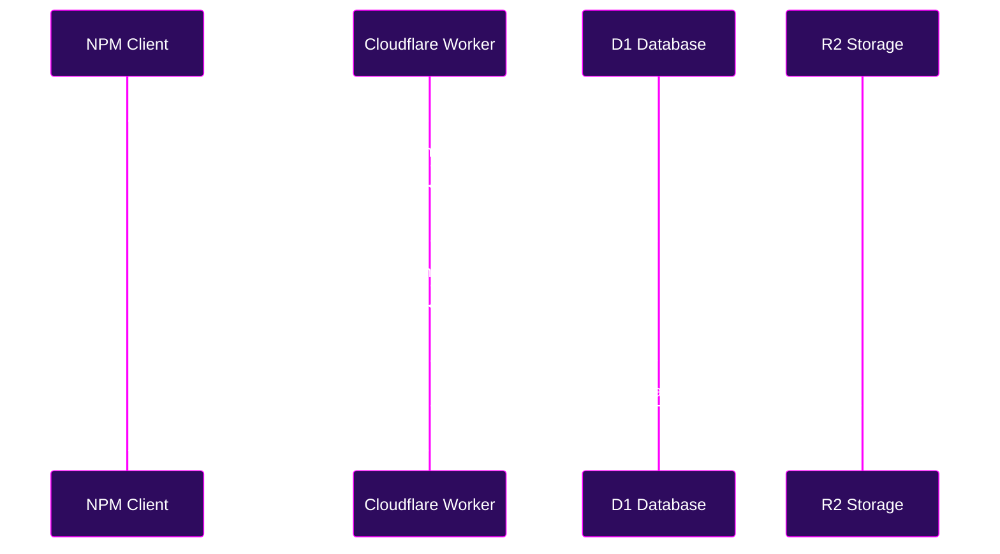

# Package Sovereignty: Distribution and Consumption

The Babadeluxe Registry provides a seamless interface for publishing and retrieving packages, ensuring that your package domain remains organized and efficient.

## Retrieving a Package

:::info
To retrieve a package, you must be authenticated and possess at least the `package:read` permission on the targeted package.
:::

You can retrieve a package by sending a `GET` request to the `/:package` endpoint.

```bash
curl -X GET https://your-babadeluxe-registry.dev/package
# Or for a scoped package:
curl -X GET https://your-babadeluxe-registry.dev/@scope/package
```

:::info
The `:package` parameter is the package you wish to retrieve. It can be a simple name or a scoped name.
:::

## Broadcasting a Package

:::info
To broadcast a package, you must be authenticated and possess at least the `package:write` permission on the targeted package.
:::

You can broadcast a package by sending a `PUT` request to the `/:package` endpoint. It is usually done by your package manager.

```bash
# Standard package:
PUT https://your-babadeluxe-registry.dev/package
# Scoped package:
PUT https://your-babadeluxe-registry.dev/@scope/package
```

---

## The Publication Flow

The following sequence diagram illustrates the sophisticated orchestration of the publication event. We see the client interacting with the Worker, which validates the token, stores metadata in D1, and tarballs in R2.


