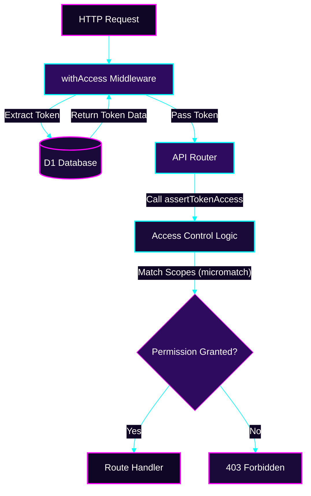

# Token Sovereignty: Managing Access

The Babadeluxe Registry provides a robust framework for managing access tokens, ensuring that your package domain remains secure yet accessible.

## Establishing a New Token
:::info
To generate a new token, you must be authenticated and possess at least the `token:write` permission with value `*`.
:::

To create a new token, send a `POST` request to the `/-/npm/v1/tokens` endpoint with the following body:

```js
{
	"name": "My token",
	"scopes": [
		{
			"type": "package:read",
			"values": ["*"]
		},
		{
			"type": "package:write",
			"values": ["@my-scope/my-package", "my-cool-package"]
		}
	]
}
```

You can include as many scopes as your vision requires.

| Scope type | Description |
| --- | --- |
| `package:read` | Read access to a package |
| `package:write` | Write access to a package |
| `package:read+write` | Read and write access to a package |
| `token:read` | Read access to a token |
| `token:write` | Write access to a token |
| `token:read+write` | Read and write access to a token |

:::info
The `values` property is an array of strings. You can use:
- `*` to match all packages.
- Exact package names (including scopes, e.g., `@my-scope/my-pkg`).
- Glob patterns (e.g., `@my-scope/*` to match all packages in a scope).
:::

## Enumerating All Tokens

You can retrieve all tokens by sending a `GET` request to the `/-/npm/v1/tokens` endpoint.

```bash
curl -X GET https://your-babadeluxe-registry.dev/-/npm/v1/tokens
```

## Retrieving a Single Token

You can inspect a specific token by sending a `GET` request to the `/-/npm/v1/tokens/token/:token` endpoint.

```bash
curl -X GET https://your-babadeluxe-registry.dev/-/npm/v1/tokens/token/my-token
```

:::info
The `:token` parameter is the token you wish to retrieve.
:::

## Excising a Token

You can delete a token by sending a `DELETE` request to the `/-/npm/v1/tokens/token/:token` endpoint.

```bash
curl -X DELETE https://your-babadeluxe-registry.dev/-/npm/v1/tokens/token/my-token
```

:::info
The `:token` parameter is the token you wish to delete.
:::

---

## Permission Flow Architecture

The following diagram illustrates how the `withAccess` middleware and `assertTokenAccess` function verify permissions during an API request.


