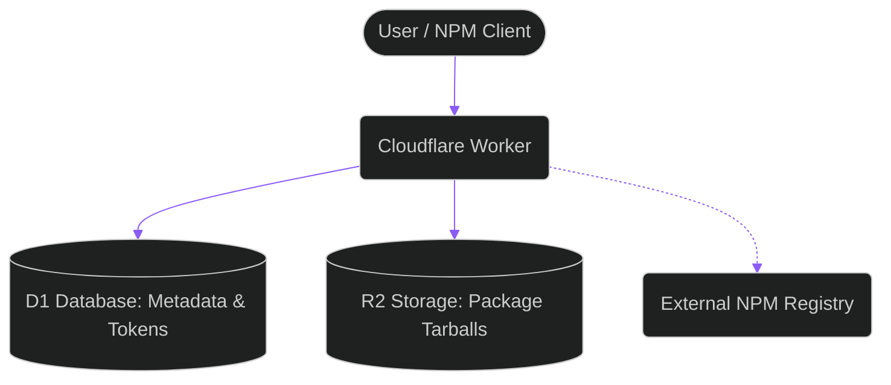
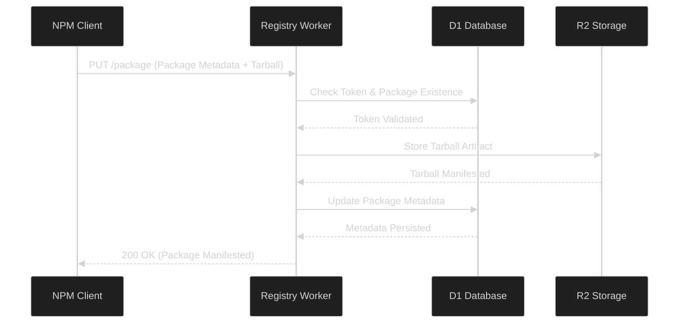

# The Babadeluxe Registry Architecture

Babadeluxe Registry is a manifestation of distributed, serverless infrastructure. At **BabaDeluxe**, we've architected this node on the Cloudflare edge, where compute and storage are intertwined to provide a low-cost, high-performance registry for our shared libraries.

## The Cognitive Node (System Overview)

The architecture is composed of several synergistic components:

- **Cloudflare Worker**: The brain of the node, processing incoming signals (HTTP requests) and orchestrating the storage.
- **D1 Database**: The memory of the node, storing package metadata, versions, and token configurations.
- **R2 Storage**: The physical storage for the binary artifacts (tarballs) of our packages.

## The Publication Event (Sequence Diagram)

When we manifest a library into the registry, a series of interactions occur. The following sequence diagram illustrates the flow of this publication event:

## The Signal Ingestion (Package Retrieval)

When a client requests a package, the Babadeluxe Registry node first checks its local D1 memory. If the package is not found, the node can proxy the request to an external registry, ensuring that our internal subnet is always connected to the global npm collective.

- If the package is in the local D1, the Worker retrieves the tarball from R2.
- If the package is not in the local D1, the Worker proxies the request to the configured `FALLBACK_REGISTRY_ENDPOINT`.
