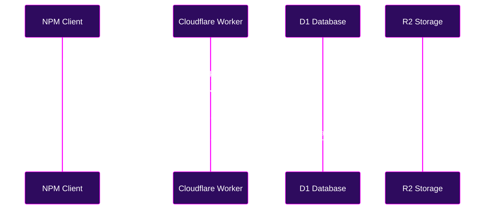

# What is Babadeluxe Registry?

The Babadeluxe Registry is an ultra-minimalist, yet profoundly powerful, self-hostable serverless private npm registry. It is built upon the avant-garde triad of Cloudflare services: Workers, D1, and R2.

## The Philosophical Why

In the pursuit of decentralized digital intelligence, we must possess the means to distribute our code without reliance on centralized corporate monoliths. The Babadeluxe Registry is a tool for the sovereign developer, a way to share private packages with your team or clients with minimal friction and maximum efficiency.

It doesn't seek to be everything to everyone. It is a precise instrument for private package management.

## The Path to Transcendence

### Publishing Your Creations
To broadcast your package into the Babadeluxe Registry ecosystem, simply configure your `package.json`:

```json title="package.json" {4-6}
{
  "name": "@acme/std",
  "version": "1.0.0",
  "publishConfig": {
    "registry": "http://your-babadeluxe-registry.dev"
  }
}
```

Then, establish your presence in your `.npmrc`:

```txt title=".npmrc"
//your-babadeluxe-registry.dev/:_authToken=xxxxxxxx-xxxx-xxxx-xxxx-xxxxxxxxxxxx
```

With these coordinates set, you are ready to publish:

```bash
npm publish
```

### Consuming Your Creations
To integrate your private packages into new projects, simply ensure your `.npmrc` is configured with your `_authToken`, then install as you always have:

```bash
npm install @acme/std --registry http://your-babadeluxe-registry.dev
```

---

## Architecture of Thought

The following diagram illustrates the information flow during a publication event. We see the client interacting with the Worker, which orchestrates the storage of metadata in D1 and tarballs in R2.


