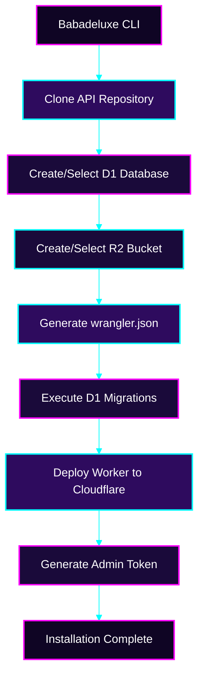

import { PackageManagerTabs } from '@theme';

# Using the Orchestrator: CLI Installation

The Babadeluxe Registry CLI (`@babadeluxe-registry/cli`) is the most direct path to a functional registry.

## 1. Cloudflare Authentication
Before invocation, ensure you have authenticated with your Cloudflare account via the Wrangler CLI:
```shell
npx wrangler login
```

## 2. Invoking the Babadeluxe Installer
Simply run the following command to begin the installation protocol:
```shell
npx @babadeluxe-registry/cli install
```

With these two steps, you have achieved a functional registry instance. 🎉

:::tip
For further exploration of the CLI's capabilities, see the [CLI Reference](../cli.mdx).
:::

---

## Deployment Logic Flow

The following diagram reveals the sophisticated choreography of the CLI installation process.


