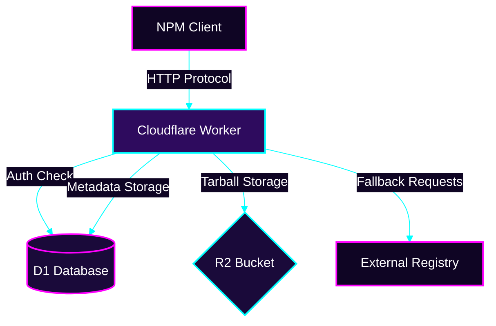

  

## The Visionary Registry

Babadeluxe Registry isn't just a server; it's a statement. In a world of bloated, centralized infrastructure, we offer a path toward distributed intelligence and sovereign package management.

### Why Babadeluxe?

Imagine a registry that scales with your ambition, yet remains as light as a thought. By leveraging Cloudflare's global edge network, Babadeluxe Registry ensures that your packages are always close to where the computation happens.

### Architecture at a Glance

